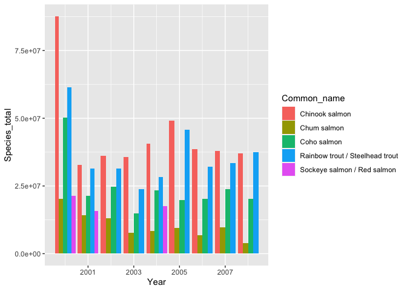
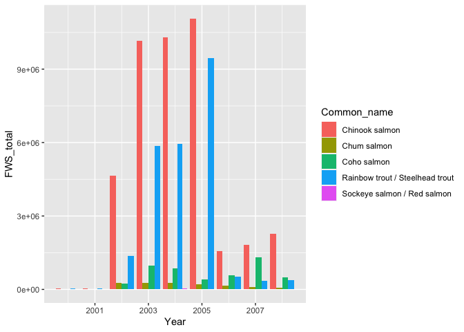
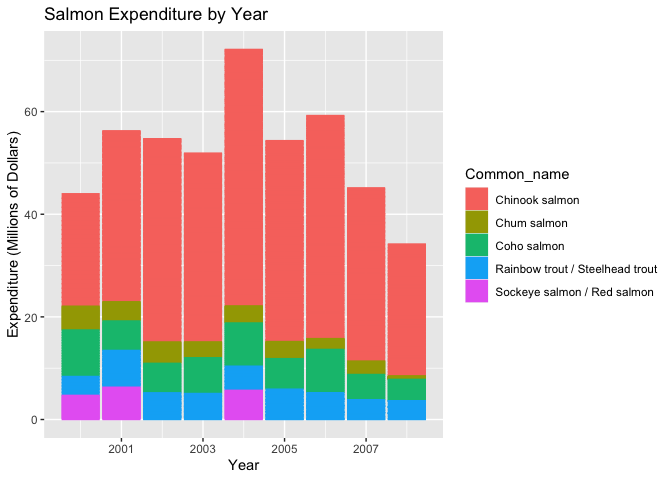
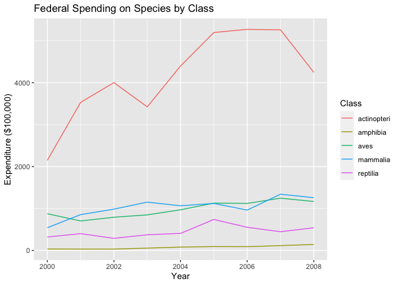
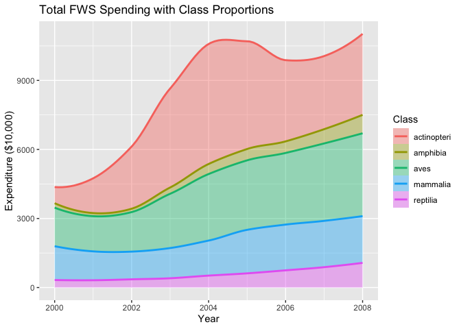
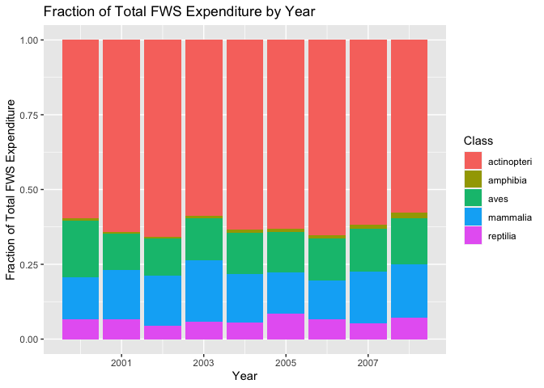
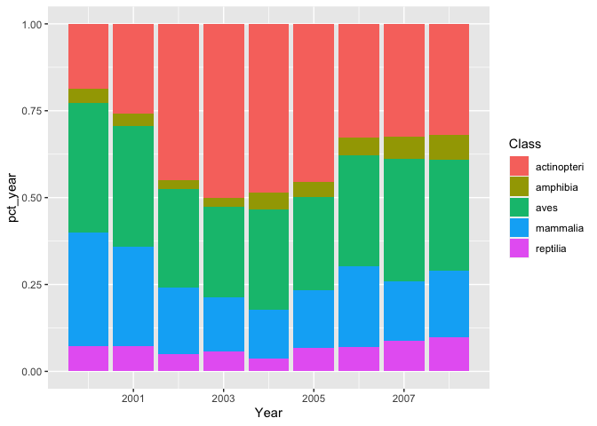

Condensed EDA
================
Nolan Choy
3/20/2021

# Setup

## Load LPI data

# Create Timeseries

``` r
LPI_data<-read.csv('../dataset/LPR2020data_public.csv')%>%
   mutate(Subspecies=ifelse(Subspecies=="NULL"|nchar(Subspecies)==0,NA,Subspecies))

LPI_only_obs<-LPI_data%>%
  pivot_longer(starts_with("X"),names_to="Year", values_to="Count")%>%
  group_by(ID)%>%
  filter(!Count=='NULL')%>%
  mutate(Year=sub('.', '', Year))
```

# Set Variable Classes

``` r
LPI_only_obs$ID<-as.factor(LPI_only_obs$ID)
LPI_only_obs$Count<-as.numeric(LPI_only_obs$Count)
LPI_only_obs$Year<-as.double(LPI_only_obs$Year)
```

# Merge LPI data with Redlist data

``` r
redlist_data<-read.csv('../dataset/redlistspecies.csv')
redlist_data$scientificName <- gsub(" ", "_", redlist_data$scientificName)

#join livingplanet with redlist
merged_data<-left_join(LPI_data,redlist_data, by=c('Binomial'='scientificName'))

#pivot
merged_timeseries<-merged_data%>%
  pivot_longer(starts_with("X"),names_to="Year", values_to="Count")%>%
  group_by(ID)%>%
  filter(!Count=='NULL')%>%
  mutate(Year=sub('.', '', Year))

#set classes
merged_timeseries$ID<-as.factor(merged_timeseries$ID)
merged_timeseries$Year<-as.double(merged_timeseries$Year)
merged_timeseries$Count<-as.numeric(merged_timeseries$Count)
merged_timeseries$redlistCategory <- factor(merged_timeseries$redlistCategory, levels = c(NA, 'Data Deficient', 'Lower Risk/least concern', 'Least Concern', 'Lower Risk/conservation dependent', 'Lower Risk/near threatened', 'Near Threatened', 'Vulnerable', 'Endangered', 'Critically Endangered', 'Extinct in the Wild', 'Extinct'))
merged_data$redlistCategory <- factor(merged_data$redlistCategory, levels = c(NA, 'Data Deficient', 'Lower Risk/least concern', 'Least Concern', 'Lower Risk/conservation dependent', 'Lower Risk/near threatened', 'Near Threatened', 'Vulnerable', 'Endangered', 'Critically Endangered', 'Extinct in the Wild', 'Extinct'))
```

# brRead

## These functions help read nested brackets

``` r
# These functions help read nested brackets

lastBrRead<-function(string){
   #lastBrRead reads the last outermost bracket
   #Example: "welcome (home) (my(lovely) gator)" %>% lastbrRead() returns "my(lovely) gator"
   openBr=0
   startpos=0
   endpos=0
   string_list<-unlist(strsplit(string, split = ""))
   for(pos in 1:nchar(string)){
      if(string_list[pos]=="("){
         if (openBr==0){
            startpos=pos
         }
         openBr<-openBr+1
      } else if(string_list[pos]==")"){
         if (openBr==1){
            endpos=pos
         }
         openBr<-openBr-1
      }
   }
   string<-substr(string,startpos+1,endpos-1)
   return(string)
}

rmBrRead<-function(string){
   if (nchar(string)==0) {return(string)}
   #rnBrRead removes any inner brackets
   #Example: "my(lovely) gator" %>% rmBrRead() returns "my gator"
   string_list<-unlist(strsplit(string, split = ""))
   openBr=0
   cutstartpos=0
   cutendpos=0
   for(pos2 in 1:nchar(string)){
      if(string_list[pos2]=="("){
         if (openBr==0){
            cutstartpos=pos2
         }
         openBr<-openBr+1
      } else if(string_list[pos2]==")"){
         if (openBr==1){
            cutendpos=pos2
         }
         openBr<-openBr-1
      }
   }
   string<-paste(substr(string, 1,cutstartpos-1), substr(string, cutendpos+1,nchar(string)), sep="")
   return(string)
}

brRead<-function(string){
   #"welcome (home) (my(lovely) gator)" %>% brRead() returns "my gator" 
   return(rmBrRead(lastBrRead(string)))
}
```

# Clean FWS Expenditure Reports

``` r
# Load data, cut rows, rename vars, set Classes
expenditure<-read_excel('../dataset/expen/2017-Expenditures-Report.xlsx')
expenditure$`Group Name`[is.na(expenditure$`Group Name`)]<-0 #set NA's as 0

expenditures_2017<-expenditure%>%
   rename(Class=`Group Name`, Species=`Species (50 CFR Part 17)`)%>% #rename variables
   mutate(temp=cumsum(Class=='Fishes subtotal'))%>% #set rows before "Fishes subtotal" to 0
   filter(temp==0)%>% #select rows before "Fishes subtotal"
   select(-temp)%>% 
   mutate(temp=cumsum(!Class=="Group Name" & !sapply(Class,nchar)<=3))%>% #set Classes
   group_by(temp)%>%
   mutate(Class=dplyr::first(Class))%>%
   ungroup()%>%
   select(-temp)

#rename Class levels
expenditures_2017$Class<-as.factor(expenditures_2017$Class)
expenditures_2017$Class<-recode(expenditures_2017$Class, "Amphibians"="Amphibia", "Fishes"="Actinopteri", "Birds"="Aves", "Reptiles"="Reptilia", "Mammals"="Mammalia")

#Set Species/Subspecies/Location/Year (because bless them for putting 3 variables in one column)
expenditures_2017<-expenditures_2017%>%
   mutate(Species_loc=str_split(Species," - "))%>% #split by "-" into c(species,location)
   mutate(Species_sci=sapply(Species_loc, "[", 1), #get Species/Location cols
          Location=sapply(Species_loc, "[", 2))%>%
   select(-Species_loc)%>%
   rowwise%>% #subset by row
   mutate(Scientific=ifelse(grepl("\\(",Species_sci),brRead(Species_sci),Species_sci))%>% #if there is no parentheses at all
   mutate(Scientific=ifelse(grepl("\\(",Species_sci),rmBrRead(Scientific),Scientific))%>% #if there is still parentheses after brRead
   ungroup()%>%
   mutate(Species=ifelse( #create Species variable
      sapply(strsplit(Scientific, "\\s{2,}| |\\)|\\(|\r\n"),length)==3, #if Species is format: (Family Species Subspecies)
      sapply(strsplit(Scientific, "\\s{2,}| |\\)|\\(|\r\n"),"[",2), #then return 2nd to last element (Species)
      sapply(strsplit(Scientific, "\\s{2,}| |\\)|\\(|\r\n"),tail,1)))%>% #else return last element (Species)
   mutate(Subspecies=ifelse( #create Subspecies variable
      sapply(strsplit(Scientific, "\\s{2,}| |\\)|\\(|\r\n"),length)==3,
      sapply(strsplit(Scientific, "\\s{2,}| |\\)|\\(|\r\n"),"[",3),
      NA)
          )%>%
   mutate(Genus=sapply(strsplit(Scientific, "\\s{2,}| |\\)|\\(|\r\n"),head,1))%>%relocate(Species, .after = Scientific)%>%
   mutate(Year=2017)

#Clean up data
expenditures_2017<-expenditures_2017%>%
   filter(!Species=="17") #indicating rows with headers
```

``` r
expen_2000<-read_excel('../dataset/expen/expenditure_2000.xlsx',3)
expenditures_2000<-expen_2000%>%
   rename(Common_name="SPECIES NAME (50 CFR PART 17)", Scientific="SCIENTIFIC NAME", Class="RANK", FWS_total="FWS TOTAL", Other_fed="OTHER FED", Fed_total="FED TOTAL", States_total="STATES TOTAL", Species_total="SPECIES TOTAL ($000)")%>% #rename variables
   filter(!is.na(Common_name))%>%
   mutate(temp=cumsum(Common_name=='FISHES Subtotals'))%>%
   filter(temp==0)%>% #select rows before "Fishes subtotal"
   select(-temp)%>%
   filter(!is.na(Class),!is.na(Scientific))

expenditures_2000<-expenditures_2000%>%
   mutate(Species=ifelse( #create Species variable
      sapply(strsplit(Scientific, "\\s{2,}| |\\)|\\(|\r\n"),length)==3, #if Species is format: (Family Species Subspecies)
      sapply(strsplit(Scientific, "\\s{2,}| |\\)|\\(|\r\n"),"[",2), #then return 2nd to last element (Species)
      sapply(strsplit(Scientific, "\\s{2,}| |\\)|\\(|\r\n"),tail,1)))%>%
   mutate(Subspecies=ifelse( #create Subspecies variable
      sapply(strsplit(Scientific, "\\s{2,}| |\\)|\\(|\r\n"),length)==3,
      sapply(strsplit(Scientific, "\\s{2,}| |\\)|\\(|\r\n"),"[",3),
      NA))%>%
   mutate(Genus=sapply(strsplit(Scientific, "\\s{2,}| |\\)|\\(|\r\n"),head,1))%>%
   mutate(Year=2000)%>%
   mutate(FWS_total=FWS_total*1000, Other_fed=Other_fed*1000, Fed_total=Fed_total*1000, States_total=States_total*1000, Species_total=Species_total*1000)%>%
   data.frame()
```

``` r
expen_2001<-read_excel('../dataset/expen/expenditure_2001.xlsx',5)
```

    ## New names:
    ## * `` -> ...1

``` r
expenditures_2001<-expen_2001%>%
   rename(Species_sci="Species (50 CFR Part 17)", Class="...1", FWS_total="FWS\r\nTotal ($)", Other_fed="Other Fed ($)", Fed_total="Fed Total ($)", States_total="States Total ($)", Species_total="Species Total ($)")%>% #rename variables
   filter(!is.na(Species_sci))%>%
   mutate(temp=cumsum(Species_sci=='Fishes Subtotal'))%>%
   filter(temp==0)%>% #select rows before "Fishes subtotal"
   select(-temp)%>%
   filter(!is.na(Class))

expenditures_2001<-expenditures_2001%>%
   rowwise%>% #subset by row
   mutate(Scientific=ifelse(grepl("\\(",Species_sci),brRead(Species_sci),Species_sci))%>% #if there is no parentheses at all
   mutate(Scientific=ifelse(grepl("\\(",Species_sci),rmBrRead(Scientific),Scientific))%>% #if there is still parentheses after brRead
   ungroup()%>%
   mutate(Species=ifelse( #create Species variable
      sapply(strsplit(Scientific, "\\s{2,}| |\\)|\\(|\r\n"),length)==3, #if Species is format: (Family Species Subspecies)
      sapply(strsplit(Scientific, "\\s{2,}| |\\)|\\(|\r\n"),"[",2), #then return 2nd to last element (Species)
      sapply(strsplit(Scientific, "\\s{2,}| |\\)|\\(|\r\n"),tail,1)))%>% #else return last element (Species)
   mutate(Subspecies=ifelse( #create Subspecies variable
      sapply(strsplit(Scientific, "\\s{2,}| |\\)|\\(|\r\n"),length)==3,
      sapply(strsplit(Scientific, "\\s{2,}| |\\)|\\(|\r\n"),"[",3),
      NA)
          )%>%
   mutate(Genus=sapply(strsplit(Scientific, "\\s{2,}| |\\)|\\(|\r\n"),head,1))%>%
   relocate(Species, .after = Scientific)%>%
   mutate(Year=2001)%>%
   data.frame()
```

``` r
expen_2002<-read_excel('../dataset/expen/expenditure_2002.xlsx',5)

expenditures_2002<-expen_2002%>%
   rename(Species_sci="Species (50 CFR Part 17)", FWS_total="FWS\r\nTotal ($)", Other_fed="Other Fed ($)", Fed_total="Fed Total ($)", States_total="States Total ($)", Species_total="Species Total ($)")%>% #rename variables
   filter(!is.na(Species_sci))%>%
   mutate(temp=cumsum(Species_sci=='Fishes Subtotal'))%>%
   filter(temp==0)%>% #select rows before "Fishes subtotal"
   select(-temp)%>%
   filter(!is.na(Class))

expenditures_2002<-expenditures_2002%>%
   rowwise%>% #subset by row
   mutate(Scientific=ifelse(grepl("\\(",Species_sci),brRead(Species_sci),Species_sci))%>% #if there is no parentheses at all
   mutate(Scientific=ifelse(grepl("\\(",Species_sci),rmBrRead(Scientific),Scientific))%>% #if there is still parentheses after brRead
   ungroup()%>%
   mutate(Species=ifelse( #create Species variable
      sapply(strsplit(Scientific, "\\s{2,}| |\\)|\\(|\r\n"),length)==3, #if Species is format: (Family Species Subspecies)
      sapply(strsplit(Scientific, "\\s{2,}| |\\)|\\(|\r\n"),"[",2), #then return 2nd to last element (Species)
      sapply(strsplit(Scientific, "\\s{2,}| |\\)|\\(|\r\n"),tail,1)))%>% #else return last element (Species)
   mutate(Subspecies=ifelse( #create Subspecies variable
      sapply(strsplit(Scientific, "\\s{2,}| |\\)|\\(|\r\n"),length)==3,
      sapply(strsplit(Scientific, "\\s{2,}| |\\)|\\(|\r\n"),"[",3),
      NA)
          )%>%
   mutate(Genus=sapply(strsplit(Scientific, "\\s{2,}| |\\)|\\(|\r\n"),head,1))%>%
   relocate(Species, .after = Scientific)%>%
   mutate(Year=2002)%>%
   data.frame()
```

``` r
expen_2003<-read_excel('../dataset/expen/expenditure_2003.xlsx',5)

expenditures_2003<-expen_2003%>%
   rename(Species_sci="Species (50 CFR Part 17)", Status="Stat- us", FWS_total="FWS\r\nTotal ($)", Other_fed="Other Fed ($)", Fed_total="Fed Total ($)", States_total="States Total ($)", Species_total="Species Total ($)")%>% #rename variables
   filter(!is.na(Species_sci))%>%
   mutate(temp=cumsum(Species_sci=='Fishes Subtotal'))%>%
   filter(temp==0)%>% #select rows before "Fishes subtotal"
   select(-temp)%>%
   filter(!is.na(Class))

expenditures_2003<-expenditures_2003%>%
   rowwise%>% #subset by row
   mutate(Scientific=ifelse(grepl("\\(",Species_sci),brRead(Species_sci),Species_sci))%>% #if there is no parentheses at all
   mutate(Scientific=ifelse(grepl("\\(",Species_sci),rmBrRead(Scientific),Scientific))%>% #if there is still parentheses after brRead
   ungroup()%>%
   mutate(Species=ifelse( #create Species variable
      sapply(strsplit(Scientific, "\\s{2,}| |\\)|\\(|\r\n"),length)==3, #if Species is format: (Family Species Subspecies)
      sapply(strsplit(Scientific, "\\s{2,}| |\\)|\\(|\r\n"),"[",2), #then return 2nd to last element (Species)
      sapply(strsplit(Scientific, "\\s{2,}| |\\)|\\(|\r\n"),tail,1)))%>% #else return last element (Species)
   mutate(Subspecies=ifelse( #create Subspecies variable
      sapply(strsplit(Scientific, "\\s{2,}| |\\)|\\(|\r\n"),length)==3,
      sapply(strsplit(Scientific, "\\s{2,}| |\\)|\\(|\r\n"),"[",3),
      NA)
          )%>%
   mutate(Genus=sapply(strsplit(Scientific, "\\s{2,}| |\\)|\\(|\r\n"),head,1))%>%
   relocate(Species, .after = Scientific)%>%
   mutate(Year=2003)%>%
   data.frame()
```

``` r
expen_2004<-read_excel('../dataset/expen/expenditure_2004.xlsx',5)

expenditures_2004<-expen_2004%>%
   rename(Species_sci="Species (50 CFR Part 17)", FWS_total="FWS\r\nTotal", Other_fed="Other Fed", Fed_total="Fed Total", States_total="States Total", Species_total="Species Total")%>% #rename variables
   filter(!is.na(Species_sci))%>%
   mutate(temp=cumsum(Species_sci=='Fishes Subtotal'))%>%
   filter(temp==0)%>% #select rows before "Fishes subtotal"
   select(-temp)%>%
   filter(!is.na(Class))

expenditures_2004<-expenditures_2004%>%
   rowwise%>% #subset by row
   mutate(Scientific=ifelse(grepl("\\(",Species_sci),brRead(Species_sci),Species_sci))%>% #if there is no parentheses at all
   mutate(Scientific=ifelse(grepl("\\(",Species_sci),rmBrRead(Scientific),Scientific))%>% #if there is still parentheses after brRead
   ungroup()%>%
   mutate(Species=ifelse( #create Species variable
      sapply(strsplit(Scientific, "\\s{2,}| |\\)|\\(|\r\n"),length)==3, #if Species is format: (Family Species Subspecies)
      sapply(strsplit(Scientific, "\\s{2,}| |\\)|\\(|\r\n"),"[",2), #then return 2nd to last element (Species)
      sapply(strsplit(Scientific, "\\s{2,}| |\\)|\\(|\r\n"),tail,1)))%>% #else return last element (Species)
   mutate(Subspecies=ifelse( #create Subspecies variable
      sapply(strsplit(Scientific, "\\s{2,}| |\\)|\\(|\r\n"),length)==3,
      sapply(strsplit(Scientific, "\\s{2,}| |\\)|\\(|\r\n"),"[",3),
      NA)
          )%>%
   mutate(Genus=sapply(strsplit(Scientific, "\\s{2,}| |\\)|\\(|\r\n"),head,1))%>%
   relocate(Species, .after = Scientific)%>%
   mutate(Year=2004)%>%
   data.frame()
```

``` r
expen_2005<-read_excel('../dataset/expen/expenditure_2005_06.xlsx',1)

expenditures_2005<-expen_2005%>%
   rename(Species_sci="Species (50 CFR Part 17)", Class="Rank", FWS_total="FWS\r\nTotal", Other_fed="Other Fed", Fed_total="Fed Total", States_total="States Total", Species_total="Species Total")%>% #rename variables
   filter(!is.na(Species_sci))%>%
   mutate(temp=cumsum(Species_sci=='Fishes Subtotal'))%>%
   filter(temp==0)%>% #select rows before "Fishes subtotal"
   select(-temp)%>%
   filter(!is.na(Class))

expenditures_2005<-expenditures_2005%>%
   rowwise%>% #subset by row
   mutate(Scientific=ifelse(grepl("\\(",Species_sci),brRead(Species_sci),Species_sci))%>% #if there is no parentheses at all
   mutate(Scientific=ifelse(grepl("\\(",Species_sci),rmBrRead(Scientific),Scientific))%>% #if there is still parentheses after brRead
   ungroup()%>%
   mutate(Species=ifelse( #create Species variable
      sapply(strsplit(Scientific, "\\s{2,}| |\\)|\\(|\r\n"),length)==3, #if Species is format: (Family Species Subspecies)
      sapply(strsplit(Scientific, "\\s{2,}| |\\)|\\(|\r\n"),"[",2), #then return 2nd to last element (Species)
      sapply(strsplit(Scientific, "\\s{2,}| |\\)|\\(|\r\n"),tail,1)))%>% #else return last element (Species)
   mutate(Subspecies=ifelse( #create Subspecies variable
      sapply(strsplit(Scientific, "\\s{2,}| |\\)|\\(|\r\n"),length)==3,
      sapply(strsplit(Scientific, "\\s{2,}| |\\)|\\(|\r\n"),"[",3),
      NA)
          )%>%
   mutate(Genus=sapply(strsplit(Scientific, "\\s{2,}| |\\)|\\(|\r\n"),head,1))%>%
   relocate(Species, .after = Scientific)%>%
   mutate(Year=2005)%>%
   data.frame()
```

``` r
expen_2006<-read_excel('../dataset/expen/expenditure_2005_06.xlsx',2)

expenditures_2006<-expen_2006%>%
   rename(Species_sci="Species (50 CFR Part 17)", FWS_total="FWS\r\nTotal", Other_fed="Other Fed", Fed_total="Fed Total", States_total="States Total", Species_total="Species Total")%>% #rename variables
   filter(!is.na(Species_sci))%>%
   mutate(temp=cumsum(Species_sci=='Fishes Subtotal'))%>%
   filter(temp==0)%>% #select rows before "Fishes subtotal"
   select(-temp)%>%
   filter(!is.na(Class))

expenditures_2006<-expenditures_2006%>%
   rowwise%>% #subset by row
   mutate(Scientific=ifelse(grepl("\\(",Species_sci),brRead(Species_sci),Species_sci))%>% #if there is no parentheses at all
   mutate(Scientific=ifelse(grepl("\\(",Species_sci),rmBrRead(Scientific),Scientific))%>% #if there is still parentheses after brRead
   ungroup()%>%
   mutate(Species=ifelse( #create Species variable
      sapply(strsplit(Scientific, "\\s{2,}| |\\)|\\(|\r\n"),length)==3, #if Species is format: (Family Species Subspecies)
      sapply(strsplit(Scientific, "\\s{2,}| |\\)|\\(|\r\n"),"[",2), #then return 2nd to last element (Species)
      sapply(strsplit(Scientific, "\\s{2,}| |\\)|\\(|\r\n"),tail,1)))%>% #else return last element (Species)
   mutate(Subspecies=ifelse( #create Subspecies variable
      sapply(strsplit(Scientific, "\\s{2,}| |\\)|\\(|\r\n"),length)==3,
      sapply(strsplit(Scientific, "\\s{2,}| |\\)|\\(|\r\n"),"[",3),
      NA)
          )%>%
   mutate(Genus=sapply(strsplit(Scientific, "\\s{2,}| |\\)|\\(|\r\n"),head,1))%>%
   relocate(Species, .after = Scientific)%>%
   mutate(Year=2006)%>%
   data.frame()
```

``` r
expen_2007<-read_excel('../dataset/expen/expenditure_2007.xlsx',1)

expenditures_2007<-expen_2007%>%
   rename(Species_sci="Species (50 CFR Part 17)", FWS_total="FWS\r\nTotal", Other_fed="Other Fed", Fed_total="Fed Total", States_total="States Total", Species_total="Species Total")%>% #rename variables
   filter(!is.na(Species_sci))%>%
   mutate(temp=cumsum(Species_sci=='Fishes Subtotal'))%>%
   filter(temp==0)%>% #select rows before "Fishes subtotal"
   select(-temp)%>%
   filter(!is.na(Class))

expenditures_2007<-expenditures_2007%>%
   rowwise%>% #subset by row
   mutate(Scientific=ifelse(grepl("\\(",Species_sci),brRead(Species_sci),Species_sci))%>% #if there is no parentheses at all
   mutate(Scientific=ifelse(grepl("\\(",Species_sci),rmBrRead(Scientific),Scientific))%>% #if there is still parentheses after brRead
   ungroup()%>%
   mutate(Species=ifelse( #create Species variable
      sapply(strsplit(Scientific, "\\s{2,}| |\\)|\\(|\r\n"),length)==3, #if Species is format: (Family Species Subspecies)
      sapply(strsplit(Scientific, "\\s{2,}| |\\)|\\(|\r\n"),"[",2), #then return 2nd to last element (Species)
      sapply(strsplit(Scientific, "\\s{2,}| |\\)|\\(|\r\n"),tail,1)))%>% #else return last element (Species)
   mutate(Subspecies=ifelse( #create Subspecies variable
      sapply(strsplit(Scientific, "\\s{2,}| |\\)|\\(|\r\n"),length)==3,
      sapply(strsplit(Scientific, "\\s{2,}| |\\)|\\(|\r\n"),"[",3),
      NA)
          )%>%
   mutate(Genus=sapply(strsplit(Scientific, "\\s{2,}| |\\)|\\(|\r\n"),head,1))%>%
   relocate(Species, .after = Scientific)%>%
   mutate(Year=2007)%>%
   data.frame()
```

``` r
expen_2008<-read_excel('../dataset/expen/expenditure_2008.xlsx',2)%>%
   select(-starts_with("..."))
```

    ## New names:
    ## * `` -> ...4
    ## * `` -> ...5
    ## * `` -> ...6
    ## * `` -> ...7
    ## * `` -> ...9
    ## * ...

``` r
expenditures_2008<-expen_2008%>%
   rename(Species_sci="Species\r\n(50 CFR Part 17)",Class="Group\r\nName", FWS_total="FWS Total", Other_fed="Other Fed", Fed_total="Fed Total", States_total="States\r\nTotal", Species_total="Species\r\nTotal")%>% #rename variables
   filter(!is.na(Class))%>%
   mutate(temp=cumsum(Class=='Fishes\r\nsubtotal'))%>%
   filter(temp==0)%>% #select rows before "Fishes subtotal"
   select(-temp)%>%
   filter(!is.na(Species_sci))

#Set Species/Subspecies/Location/Year (because bless them for putting 3 variables in one column)
expenditures_2008<-expenditures_2008%>%
   rowwise%>% #subset by row
   mutate(Scientific=ifelse(grepl("\\(",Species_sci),brRead(Species_sci),Species_sci))%>% #if there is no parentheses at all
   mutate(Scientific=ifelse(grepl("\\(",Species_sci),rmBrRead(Scientific),Scientific))%>% #if there is still parentheses after brRead
   ungroup()%>%
   mutate(Species=ifelse( #create Species variable
      sapply(strsplit(Scientific, "\\s{2,}| |\\)|\\(|\r\n"),length)==3, #if Species is format: (Family Species Subspecies)
      sapply(strsplit(Scientific, "\\s{2,}| |\\)|\\(|\r\n"),"[",2), #then return 2nd to last element (Species)
      sapply(strsplit(Scientific, "\\s{2,}| |\\)|\\(|\r\n"),tail,1)))%>% #else return last element (Species)
   mutate(Subspecies=ifelse( #create Subspecies variable
      sapply(strsplit(Scientific, "\\s{2,}| |\\)|\\(|\r\n"),length)==3,
      sapply(strsplit(Scientific, "\\s{2,}| |\\)|\\(|\r\n"),"[",3),
      NA)
          )%>%
   mutate(Genus=sapply(strsplit(Scientific, "\\s{2,}| |\\)|\\(|\r\n"),head,1))%>%
   relocate(Species, .after = Scientific)%>%
   mutate(Year=2008)%>%
   data.frame()

#Clean up data
expenditures_2008<-expenditures_2008%>%
   filter(!Species=="17") #indicating rows with headers
```

# Join Expenditure Reports with Time Series LPI/Redlist Data

``` r
#Vertical join by columns (time series format)
expenditures_timeseries<-rbind(
   expenditures_2000%>%
      select(Class, Genus, Species, Subspecies, FWS_total, Other_fed, Fed_total, States_total, Species_total, Year),
   expenditures_2001%>%
      select(Class, Genus, Species, Subspecies, FWS_total, Other_fed, Fed_total, States_total, Species_total, Year),
   expenditures_2002%>%
      select(Class, Genus, Species, Subspecies, FWS_total, Other_fed, Fed_total, States_total, Species_total, Year),
   expenditures_2003%>%
      select(Class, Genus, Species, Subspecies, FWS_total, Other_fed, Fed_total, States_total, Species_total, Year),
   expenditures_2004%>%
      select(Class, Genus, Species, Subspecies, FWS_total, Other_fed, Fed_total, States_total, Species_total, Year),
   expenditures_2005%>%
      select(Class, Genus, Species, Subspecies, FWS_total, Other_fed, Fed_total, States_total, Species_total, Year),
   expenditures_2006%>%
      select(Class, Genus, Species, Subspecies, FWS_total, Other_fed, Fed_total, States_total, Species_total, Year),
   expenditures_2007%>%
      select(Class, Genus, Species, Subspecies, FWS_total, Other_fed, Fed_total, States_total, Species_total, Year),
   expenditures_2008%>%
      select(Class, Genus, Species, Subspecies, FWS_total, Other_fed, Fed_total, States_total, Species_total, Year)
   )

#Coerce uniformity along join keys by setting to lowercase
merged_timeseries<-merged_timeseries %>%
   mutate(Class = tolower(Class),
          Species = tolower(Species),
          Subspecies = tolower(Subspecies),
          Genus = tolower(Genus))

expenditures_timeseries<-expenditures_timeseries%>%
   mutate(Class = tolower(Class),
          Species = tolower(Species),
          Subspecies = tolower(Subspecies),
          Genus = tolower(Genus))

#Set classes
expenditures_timeseries$FWS_total<-as.numeric(expenditures_timeseries$FWS_total)
expenditures_timeseries$Other_fed<-as.numeric(expenditures_timeseries$Other_fed)
expenditures_timeseries$Fed_total<-as.numeric(expenditures_timeseries$Fed_total)
expenditures_timeseries$States_total<-as.numeric(expenditures_timeseries$States_total)
expenditures_timeseries$Species_total<-as.numeric(expenditures_timeseries$Species_total)
expenditures_timeseries$Year<-as.double(expenditures_timeseries$Year)

LPI_red_expen_ts<-merged_timeseries%>%left_join(.,expenditures_timeseries,by=c("Year","Genus", "Species", "Class"))
```

``` r
LPI_red_expen_ts%>%filter(Year %in% c(2000:2008), Genus=="oncorhynchus", !is.na(Species_total))%>%ggplot(aes(Year, Species_total,fill=Common_name))+geom_bar(stat="identity",position = "dodge")
```

<!-- -->

``` r
LPI_red_expen_ts%>%filter(Year %in% c(2000:2008), Genus=="oncorhynchus", !is.na(FWS_total))%>%ggplot(aes(Year, FWS_total,fill=Common_name))+geom_bar(stat="identity",position = "dodge")
```

<!-- -->

``` r
LPI_red_expen_ts%>%filter(Year %in% c(2000:2008), Genus=="oncorhynchus", !is.na(Species_total))%>%ggplot(aes(Year, y=(Species_total/100000000),fill=Common_name,col=Common_name))+geom_bar(stat="identity")+labs(title="Salmon Expenditure by Year", y="Expenditure (Millions of Dollars)")
```

<!-- -->

``` r
#https://www.taxpayer.net/infrastructure/failing-salmon-recovery-efforts-are-costing-taxpayers-billions/

expenditures_timeseries%>%group_by(Species,Genus,Class,Year)%>%mutate(Fed_total=ifelse(is.na(Species_total),0,Fed_total))%>%summarize(n=sum(Fed_total))%>%group_by(Class,Year)%>%summarize(sum=sum(n))%>%ggplot(aes(Year,sum/100000,col=Class))+geom_line()+labs(title="Federal Spending on Species by Class", y="Expenditure ($100,000)")
```

    ## `summarise()` regrouping output by 'Species', 'Genus', 'Class' (override with `.groups` argument)

    ## `summarise()` regrouping output by 'Class' (override with `.groups` argument)

<!-- -->

``` r
expenditures_timeseries%>%group_by(Species,Genus,Class,Year)%>%mutate(FWS_total=ifelse(is.na(Species_total),0,FWS_total))%>%summarize(n=sum(FWS_total))%>%group_by(Class,Year)%>%summarize(sum=sum(n))%>%ggplot(aes(Year,sum/10000,col=Class,fill=Class))+geom_smooth(position = "stack")+labs(title="Total FWS Spending with Class Proportions", y="Expenditure ($10,000)")
```

    ## `summarise()` regrouping output by 'Species', 'Genus', 'Class' (override with `.groups` argument)
    ## `summarise()` regrouping output by 'Class' (override with `.groups` argument)

    ## `geom_smooth()` using method = 'loess' and formula 'y ~ x'

    ## Warning: Stacking not well defined when not anchored on the axis

<!-- -->

``` r
expenditures_timeseries%>%
   group_by(Species,Genus,Class,Year)%>%mutate(Species_total=ifelse(is.na(Species_total),0,Species_total))%>%summarize(n=sum(Species_total))%>%group_by(Class,Year)%>%summarize(sum=sum(n))%>%group_by(Year)%>%mutate(pct_year=sum/sum(sum))%>%ggplot(aes(Year,pct_year,fill=Class))+geom_col()+labs(title="Fraction of Total FWS Expenditure by Year", y="Fraction of Total FWS Expenditure")
```

    ## `summarise()` regrouping output by 'Species', 'Genus', 'Class' (override with `.groups` argument)

    ## `summarise()` regrouping output by 'Class' (override with `.groups` argument)

<!-- -->

``` r
expenditures_timeseries%>%group_by(Species,Genus,Class,Year)%>%mutate(FWS_total=ifelse(is.na(Species_total),0,FWS_total))%>%summarize(n=sum(FWS_total))%>%group_by(Class,Year)%>%summarize(sum=sum(n))%>%group_by(Year)%>%mutate(pct_year=sum/sum(sum))%>%ggplot(aes(Year,pct_year,fill=Class))+geom_col()
```

    ## `summarise()` regrouping output by 'Species', 'Genus', 'Class' (override with `.groups` argument)
    ## `summarise()` regrouping output by 'Class' (override with `.groups` argument)

<!-- -->
