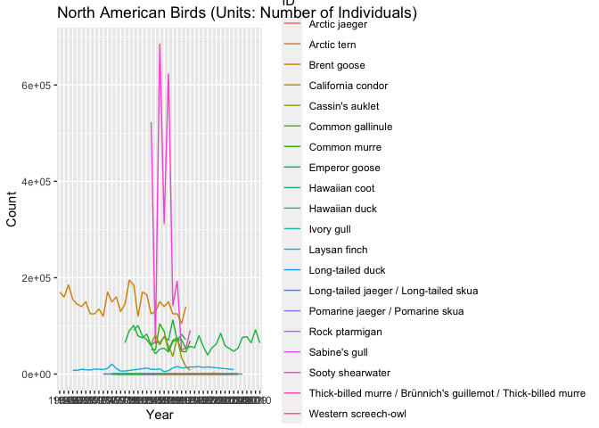
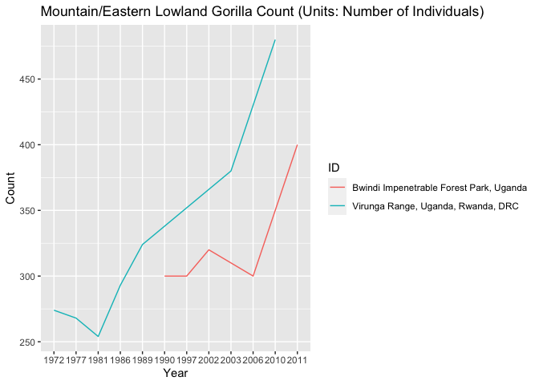
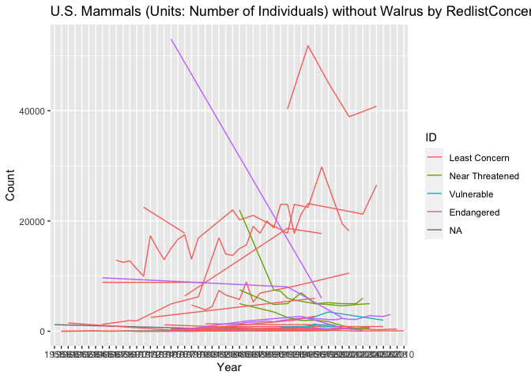
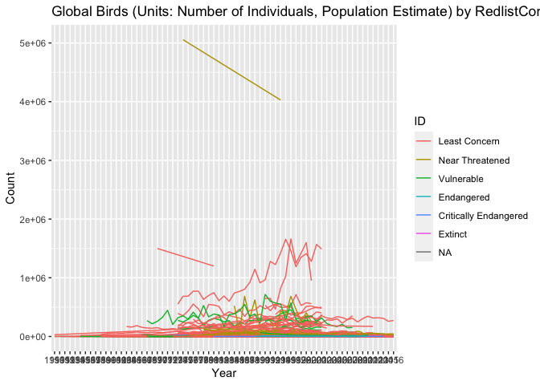
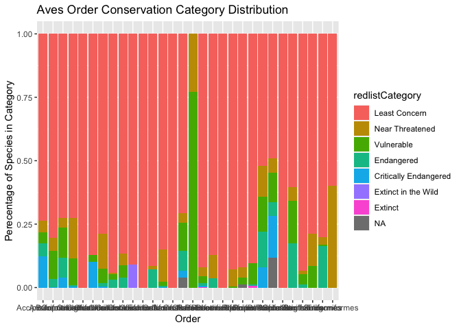
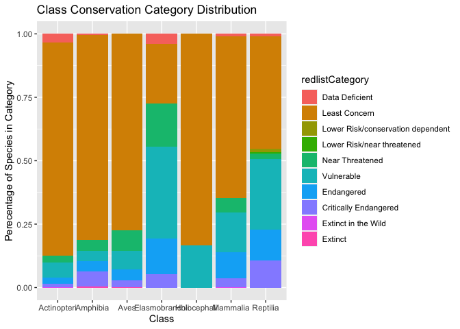

LPI Code
================
Nolan Choy
3/17/2021

## Pivot to time series format:

``` r
LPI_only_obs<-LPI_data%>%
  pivot_longer(starts_with("X"),names_to="Year", values_to="Count")%>%
  group_by(ID)%>%
  filter(!Count=='NULL')%>%
  mutate(Year=sub('.', '', Year))

head(LPI_only_obs%>%select(ID,Common_name, Location, Year, Count),10)
```

    ## # A tibble: 10 x 5
    ## # Groups:   ID [1]
    ##       ID Common_name             Location                   Year  Count
    ##    <int> <chr>                   <chr>                      <chr> <chr>
    ##  1     4 Seychelles magpie-robin Fregate Island, Seychelles 1976  46   
    ##  2     4 Seychelles magpie-robin Fregate Island, Seychelles 1977  39   
    ##  3     4 Seychelles magpie-robin Fregate Island, Seychelles 1978  38   
    ##  4     4 Seychelles magpie-robin Fregate Island, Seychelles 1979  38   
    ##  5     4 Seychelles magpie-robin Fregate Island, Seychelles 1980  38   
    ##  6     4 Seychelles magpie-robin Fregate Island, Seychelles 1981  24   
    ##  7     4 Seychelles magpie-robin Fregate Island, Seychelles 1982  24   
    ##  8     4 Seychelles magpie-robin Fregate Island, Seychelles 1983  21   
    ##  9     4 Seychelles magpie-robin Fregate Island, Seychelles 1984  25   
    ## 10     4 Seychelles magpie-robin Fregate Island, Seychelles 1985  26

Set a couple variables as factors or numeric

``` r
LPI_only_obs$ID<-as.factor(LPI_only_obs$ID)
LPI_only_obs$Count<-as.numeric(LPI_only_obs$Count)
```

## Mammal Plot

``` r
LPI_only_obs%>%
  filter(Units=="Number of individuals", Class=='Mammalia', Country=="United States", !ID==2218)%>%
  ggplot(aes(x=Year,y=Count,group=ID,col=ID))+
  geom_line(aes(col=Common_name))+
  labs(title="U.S. Mammals (Units: Number of Individuals) without Walrus")
```

<!-- -->

Walrus was an outlier visually.

## Bird Plot

``` r
LPI_only_obs%>%
   filter(Units=="Number of individuals", Class=='Aves', Region=='North America')%>%
   ggplot(aes(x=Year,y=Count,group=ID,col=ID))+
   geom_line(aes(col=Common_name))+
   labs(title="North American Birds (Units: Number of Individuals)")
```

<!-- -->

## Gorilla Plot

``` r
LPI_only_obs%>%
   filter(Common_name=="Western gorilla", Units=="Number of individuals"| Units=="Estimated number of individuals")%>%
   ggplot(aes(x=Year,y=Count,group=ID,col=ID))+
   geom_line(aes(col=Location))+
   labs(title="Western Gorilla Count (Units: (Estimated) Number of Individuals)")
```

<!-- -->

``` r
LPI_only_obs%>%
   filter(Genus=="Gorilla", Units=="Number of individuals")%>%
   ggplot(aes(x=Year,y=Count,group=ID,col=ID))+
   geom_line(aes(col=Location))+
   labs(title="Mountain/Eastern Lowland Gorilla Count (Units: Number of Individuals)")
```

<!-- -->

# Merging with Redlist Data

Merging data from IUCN (notably, this data is from simple\_summary.csv
whereas data from assessment contains rationales for conservation
status)

``` r
setwd('..')
redlist_data<-read.csv('./dataset/redlistspecies.csv')
redlist_data$scientificName <- gsub(" ", "_", redlist_data$scientificName)

#join livingplanet with redlist
merged_data<-left_join(LPI_data,redlist_data, by=c('Binomial'='scientificName'))

#pivot
merged_timeseries<-merged_data%>%
  pivot_longer(starts_with("X"),names_to="Year", values_to="Count")%>%
  group_by(ID)%>%
  filter(!Count=='NULL')%>%
  mutate(Year=sub('.', '', Year))

#set types
merged_timeseries$ID<-as.factor(merged_timeseries$ID)
merged_timeseries$Count<-as.numeric(merged_timeseries$Count)
merged_timeseries$redlistCategory <- factor(merged_timeseries$redlistCategory, levels = c(NA, 'Data Deficient', 'Lower Risk/leask concern', 'Least Concern', 'Lower Risk/conservation dependent', 'Lower Risk/near threatened', 'Near Threatened', 'Vulnerable', 'Endangered', 'Critically Endangered', 'Extinct in the Wild', 'Extinct'))
merged_data$redlistCategory <- factor(merged_data$redlistCategory, levels = c(NA, 'Data Deficient', 'Lower Risk/leask concern', 'Least Concern', 'Lower Risk/conservation dependent', 'Lower Risk/near threatened', 'Near Threatened', 'Vulnerable', 'Endangered', 'Critically Endangered', 'Extinct in the Wild', 'Extinct'))
```

### US Mammal Plot by Redlist Status

``` r
merged_timeseries%>%
  filter(Units=="Number of individuals", Class=='Mammalia', Country=="United States", !ID==2218)%>%
  ggplot(aes(x=Year,y=Count,group=ID,col=ID))+
  geom_line(aes(col=redlistCategory))+
  labs(title="U.S. Mammals (Units: Number of Individuals) without Walrus by RedlistConcern")
```

<!-- -->

### Aves Order Conservation Category Distribution

``` r
merged_timeseries%>%
   filter(Units=="Number of individuals" | Units=="Population estimate", Class=='Aves')%>%
   ggplot(aes(x=Year,y=Count,group=ID,col=ID))+
   geom_line(aes(col=redlistCategory))+
   labs(title="Global Birds (Units: Number of Individuals, Population Estimate) by RedlistConcern")
```

<!-- -->

``` r
merged_timeseries%>%
   filter(Class=="Aves")%>%
   group_by(redlistCategory,Order)%>%
   summarize(Category_count=n())%>%
   ungroup()%>%group_by(Order)%>%
   mutate(pct_Cat=Category_count/sum(Category_count))%>%
   ggplot(aes(Order,pct_Cat,fill=redlistCategory))+geom_col()+labs(title="Aves Order Conservation Category Distribution", y="Perecentage of Species in Category")
```

    ## `summarise()` regrouping output by 'redlistCategory' (override with `.groups` argument)

<!-- -->

### Extinct Species list

``` r
merged_data%>%filter(redlistCategory=="Extinct")%>%select(c(Common_name))
```

    ##              Common_name
    ## 1          Atitlan grebe
    ## 2 Longnose stubfoot toad
    ## 3            Golden toad
    ## 4      Guam reed-warbler
    ## 5      Bridled white-eye

Odd that Bridled white-eye is “Extinct” despite all other sources
claiming their population to be Endangered.

## Class Conservation Category Distribution

``` r
merged_data%>%
   filter(!is.na(redlistCategory))%>%
   group_by(redlistCategory,Class)%>%
   summarize(Category_count=n())%>%
   ungroup()%>%group_by(Class)%>%
   mutate(pct_Cat=Category_count/sum(Category_count))%>%
   ggplot(aes(Class,pct_Cat,fill=redlistCategory))+geom_col()+labs(title="Class Conservation Category Distribution", y="Perecentage of Species in Category")
```

    ## `summarise()` regrouping output by 'redlistCategory' (override with `.groups` argument)

<!-- -->

This could be because certain Classes have more species.
