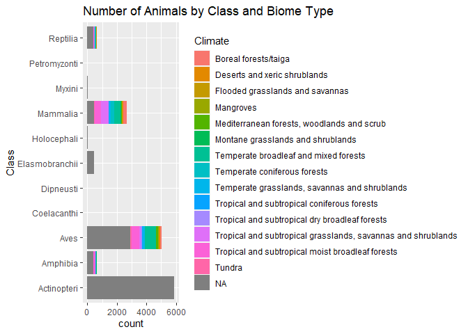
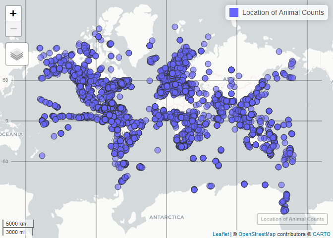
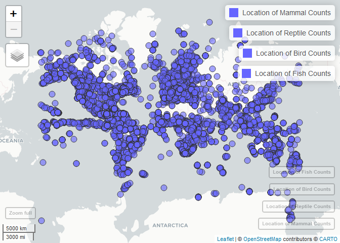
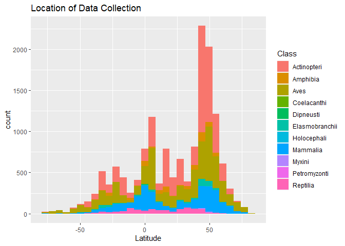
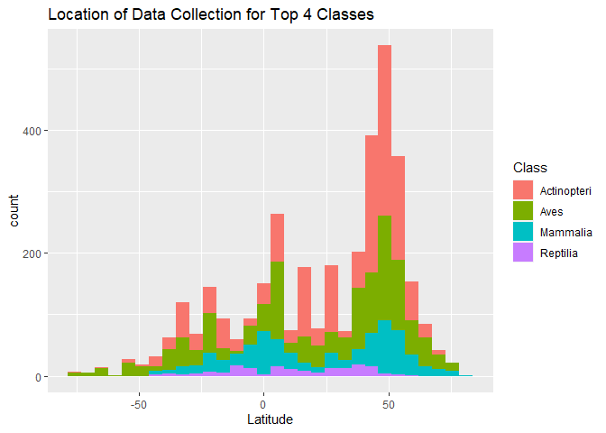

Project stuff
================
Cole Hunter
3/19/2021

\#\#Loading in

\#\#NA’s

``` r
#Getting all the null values as NA
animals[apply(animals, 2, function(x) x=="NULL")] = NA

percent_na <- sum(is.na(animals))/(15348*98)

cat("Given",percent_na,"percent of the data is stored as NA values,
    it would be helpful to know if the unknown values are common to the rows or 
    columns")
```

    ## Given 0.6482491 percent of the data is stored as NA values,
    ##     it would be helpful to know if the unknown values are common to the rows or 
    ##     columns

``` r
# colSums(is.na(animals))

na_col <- as_tibble(map(animals, ~sum(is.na(.)))) %>% select(30:98)
na_row <- na_col %>% pivot_longer(cols =1:69 ,names_to = "Year", values_to = "Missing")


# Graph of missing data percentage for time series portion of data
na_row %>%
  filter(Missing!=0) %>%
  ggplot(aes(x = Year, y = Missing/nrow(animals), fill = Missing/nrow(animals) ))+
  geom_bar(stat = 'identity')+
  scale_fill_viridis_b()+
  labs(title = "Percent of Missing Time Series Data by Year",y = "", fill = "Percent Missing")
```

<!-- -->

``` r
#Percent of time series data missing
missing_ts <- sum(na_row$Missing)/(nrow(animals)*69)
print(missing_ts)
```

    ## [1] 0.8411321

A big problem with the data set is that it has too many missing values
for the time series data. From the graph above, we can see that there is
less missing data between the mid 1980’s and early 1990’s, but towards
the beginning of when there stats were tracked, as well as in more
recent times, the amount of data available for us to track changes over
time is extremely limited. With this in mind, it seems like it would be
best to try and see what trends we can observe in the data, and use that
to target a new data set to analyze that contains more data about animal
population trends, perhaps in certain regions.

``` r
#Taking a look at the types of animals
animals %>%
  ggplot(aes(y = Class, fill = T_biome))+
  geom_bar()+
  labs(title = "Number of Animals by Class and Biome Type", xlab = "Count",
       ylab = "Class", fill = "Climate")
```

<!-- -->

``` r
cat("From the plot we can see that the most represented animals in the data set are mammals, fish, birds, mammals and reptiles.")
```

    ## From the plot we can see that the most represented animals in the data set are mammals, fish, birds, mammals and reptiles.

``` r
#Map data
#Need to get the latitude values into the correct format, remove trailing 0's
animals$Latitude <- as.numeric(str_remove(animals$Latitude, "0+"))

#Splitting into the most represented Classes
mammals <- animals %>% filter(Class == "Mammalia") %>% select(ID,Latitude,Longitude)
reptiles <- animals %>% filter(Class == "Reptilia") %>% select(ID,Latitude,Longitude)
birds <- animals %>% filter(Class == "Aves") %>% select(ID,Latitude,Longitude)
fish <- animals %>% filter(Class == "Actinopteri") %>% select(ID,Latitude,Longitude)
fish <- na.omit(fish)
mammals <- na.omit(mammals)
birds <- na.omit(birds)
reptiles <- na.omit(reptiles)

# All of the collection points
animal_loc <- animals %>%
  filter(!is.na(Latitude),!is.na(Longitude), Specific_location == "Yes") %>%
  select(ID, Class, Latitude, Longitude)
mapview(animal_loc, xcol = "Longitude", ycol = "Latitude", crs = 4326,layer.name = "Location of Animal Counts")
```

    ## Warning in sf::st_is_longlat(x): bounding box has potentially an invalid value
    ## range for longlat data

    ## Warning in sf::st_is_longlat(x): bounding box has potentially an invalid value
    ## range for longlat data

<!-- -->

``` r
#Plotting the collection location on a map
mammal_map <- mapview(mammals,xcol = "Longitude", ycol = "Latitude", crs = 4326, grid = FALSE,layer.name = "Location of Mammal Counts")
reptile_map <- mapview(reptiles,xcol = "Longitude", ycol = "Latitude", crs = 4326, grid = FALSE,layer.name = "Location of Reptile Counts")
bird_map <- mapview(birds,xcol = "Longitude", ycol = "Latitude", crs = 4326, grid = FALSE,layer.name = "Location of Bird Counts")
fish_map <- mapview(fish,xcol = "Longitude", ycol = "Latitude", crs = 4326, grid = FALSE,layer.name = "Location of Fish Counts")

major_maps <- mammal_map+reptile_map+bird_map+fish_map
major_maps
```

<!-- -->

``` r
# Get an idea of where the bulk of the data points are collected
animals %>% ggplot(aes(Latitude, fill = Class))+geom_histogram()+
  labs(title = "Location of Data Collection")
```

    ## `stat_bin()` using `bins = 30`. Pick better value with `binwidth`.

    ## Warning: Removed 7 rows containing non-finite values (stat_bin).

<!-- -->

``` r
# Can get an idea of where the 4 most common Classes are located
animals %>%
  filter(Class == c('Mammalia','Reptilia','Actinopteri','Aves')) %>% 
  ggplot(aes(Latitude, fill = Class))+geom_histogram()+
  labs(title = "Location of Data Collection for Top 4 Classes")
```

    ## `stat_bin()` using `bins = 30`. Pick better value with `binwidth`.

    ## Warning: Removed 2 rows containing non-finite values (stat_bin).

<!-- -->

``` r
#Majority of the collected species are located in the Northern Hemisphere, check the actual value

nhem_per <- sum(animals$Latitude>=0,na.rm = TRUE)/length(!is.na(animals$Latitude))
print(nhem_per)
```

    ## [1] 0.7637477

From the above graphs, we can see that the collection sites of animals
is mostly concentrated in the northern hemisphere. In fact, out of the
15348 animals that have been counted in this data set, 76 percent of
those were located in the northern hemisphere.

Its also interesting to note that the graphs for reptiles is the one
that shows the tightest spread of count locations relative to the
equator.

It would be helpful to get a sense of how this data lines up relative to
the general location of collections.

``` r
top_ten_loc  <- animals %>% group_by(Location) %>% summarize(count = n()) %>%  arrange(desc(count)) %>% head(10)
top_ten_loc
```

    ## # A tibble: 10 x 2
    ##    Location                                                                count
    ##    <chr>                                                                   <int>
    ##  1 United States and Canada                                                  388
    ##  2 Near and in a patch of semideciduous forest in cane fields, central Sã~   180
    ##  3 NAFO 4X                                                                   144
    ##  4 Hecate Strait, British Columbia                                           119
    ##  5 Queen Charlotte Sound, British Columbia                                   109
    ##  6 West Coast Vancouver Island, British Columbia                              91
    ##  7 Haida Gwaii, British Columbia                                              88
    ##  8 NAFO 4VW                                                                   71
    ##  9 NAFO 4W                                                                    67
    ## 10 NAFO 3Ps                                                                   65

``` r
top_ten_country <-animals %>% group_by(Country) %>% summarize(count = n()) %>%  arrange(desc(count)) %>% head(10)
top_ten_country
```

    ## # A tibble: 10 x 2
    ##    Country        count
    ##    <chr>          <int>
    ##  1 Canada          3158
    ##  2 United States   1919
    ##  3 Australia        857
    ##  4 Brazil           623
    ##  5 South Africa     498
    ##  6 Spain            462
    ##  7 United Kingdom   417
    ##  8 Norway           383
    ##  9 India            286
    ## 10 Belize           285

``` r
# Looking for only the counts that are individual counts
only_ind <- animals %>% filter(Units == "Number of Individuals" |
                       Units == "Number of individuals" |
                       Units == "individuals" |
                       Units == "Individuals")
missing_ind <- (sum(is.na(only_ind))/(nrow(only_ind)*ncol(only_ind)))
missing_ind
```

    ## [1] 0.6712848

This seems to be an issue that no amount of cleaning can take care of.
Even after filtering for those counts which only represent some form of
an individual count for the given animal, the data still contains
missing values for over 67 percent of its values.

``` r
# Need to see how many different methods of counting are used in the data set
# count_methods <- c(unique(animals_adj$Method))
# cat(length(count_methods))
# 
# 
# animals_adj <- animals %>%
#   pivot_longer(cols = '1950':ncol(animals), names_to = "Year", values_to = "Counts") %>%
#   filter(!is.na(Counts))

# animals_adj %>% group_by(ID) %>% filter(Counts<10000) %>% ggplot(aes(x = Year, y = Counts ))+
#   geom_point(stat = 'identity')
```
