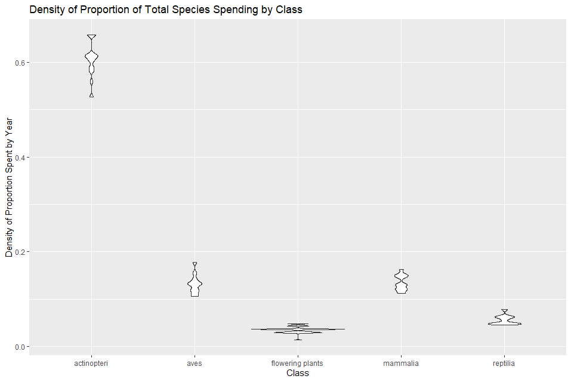

Since we’ve so far had little success navigating the Living Planet Index dataset, we have shifted our focus to the expenditures datasets, and will plan to use the LPI dataset as background and support to the data on government expenditures on different species. Further work will be focused on the expenditure data and the specific species that have been given significant funding, as well as on understanding the other types of factors that impact expenditures.

We also explored Species with the highest spending in their class and found that, visually, there may be a lagged negative relationship between population trend and changes in expenditure.

However, it should be noted that the differences in type of relationship may be a cause for noise in some of our original analyses—further analysis may have to be narrowed down to those classes of species whose counts display similar types of relationships with spending.

The degree to which fish exist as outliers in the data set also deserves mention. Every single year that we have data for, fish account for at least 50% of total spending, with the closest non-fish class of animal taking up just under 20%. Also notable is the fact that spending is visibly stratified into 5 main groups. Fish always receive the bulk of the funding, followed by some mixture of birds and mammals, then reptiles, followed by flowering plants. The remaining 10 classes quickly approach less than 1% of total spending. 

